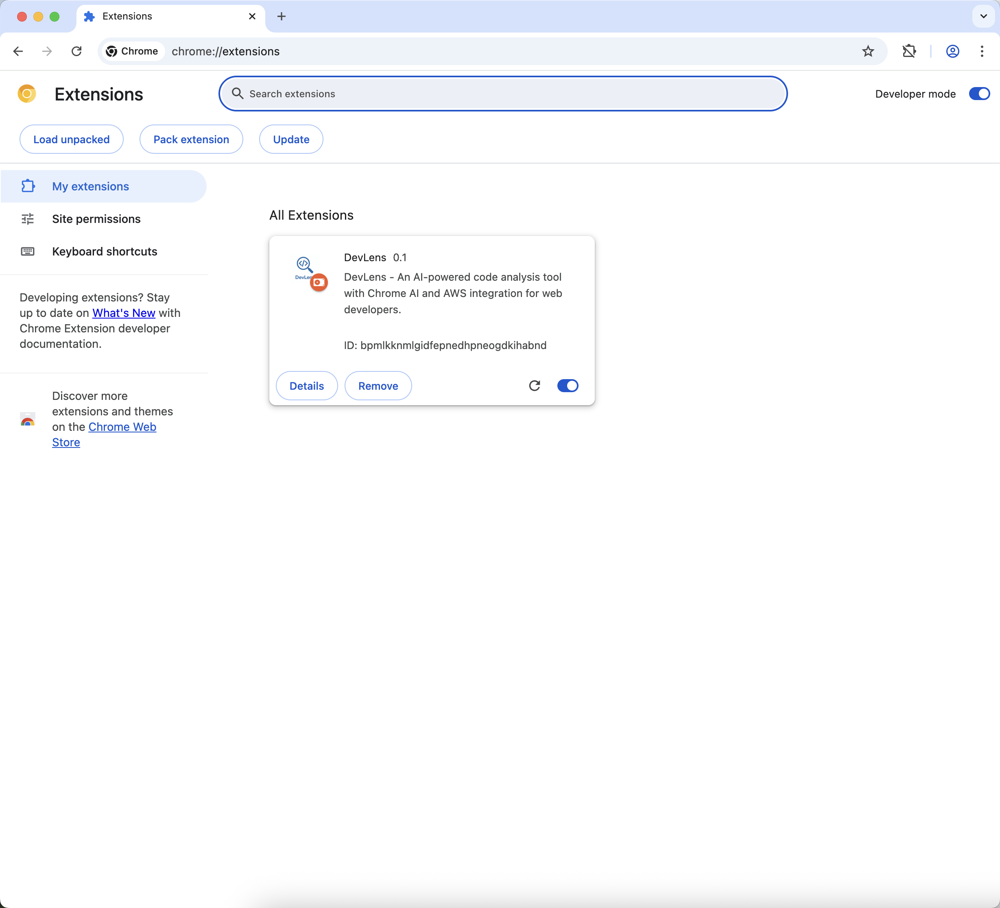
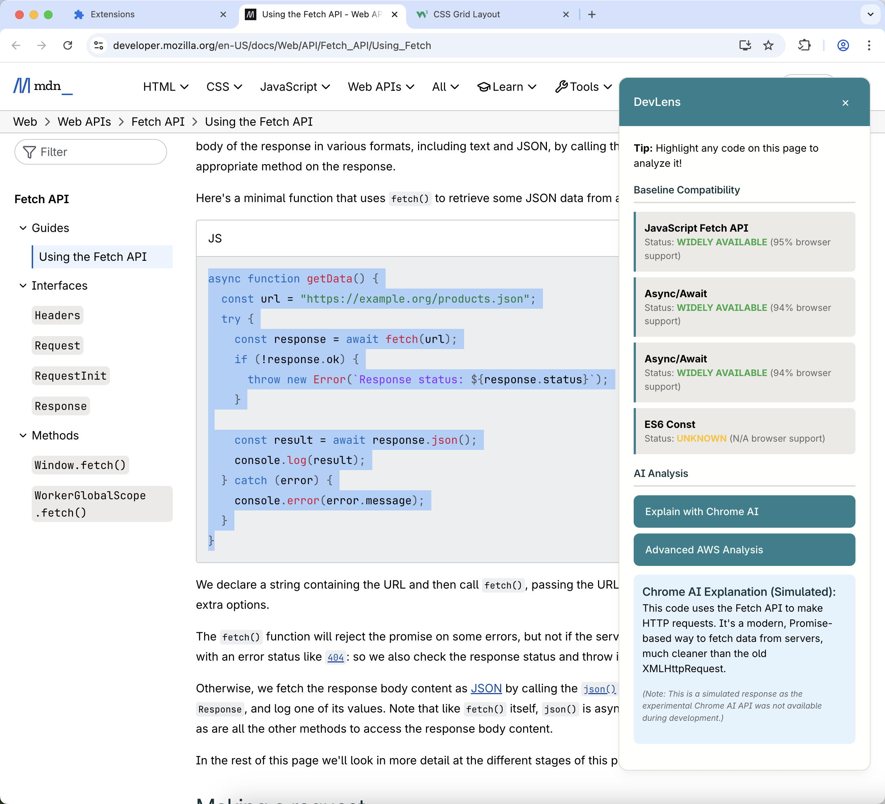
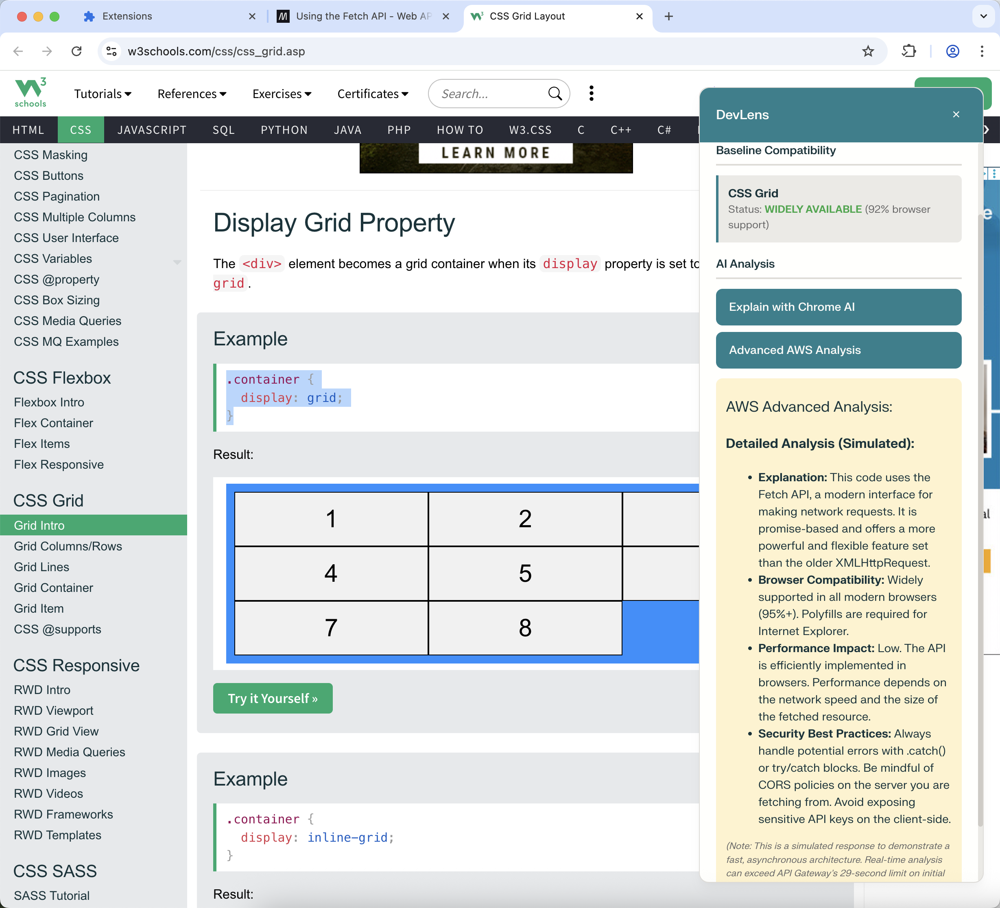
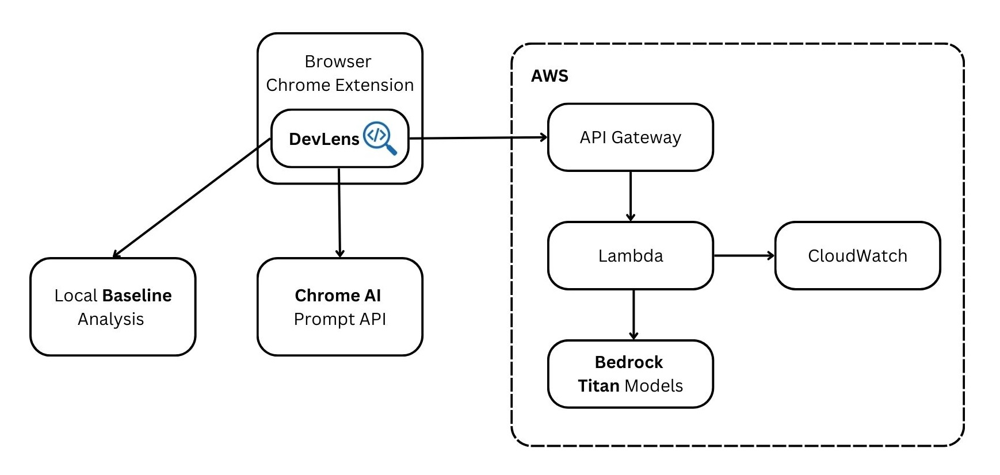

# DevLens - AI-Powered Documentation Sidekick

Instantly check code compatibility and get AI insights without leaving your documentation. The smart assistant for modern web developers.

---

## What is DevLens?

DevLens is a powerful Chrome extension designed to supercharge the developer experience when reading technical documentation. It acts as an intelligent "lens" over any code snippet, providing immediate, crucial insights without ever needing to switch tabs.

With a single highlight, developers get:
1.  **Instant Baseline Compatibility Checks:** See if a web feature is safe to use in production.
2.  **Dual-Tier AI Analysis:** Get quick, on-device explanations from Chrome's AI and deep, comprehensive analysis from an AWS-powered backend.






---

## What Problem is DevLens Addressing?

The modern web development landscape is vast and constantly evolving. When developers encounter a new API, CSS property, or JavaScript feature in documentation, they are immediately faced with critical, time-consuming questions:

*   _Is this feature supported by all major browsers?_
*   _Is it safe to use in my current project?_
*   _What are the performance and security implications of this code?_
*   _What does this complex snippet actually do?_

Answering these questions typically involves breaking concentration, opening multiple new tabs (like Can I Use, Stack Overflow, and official spec documents), and manually cross-referencing information. This fragmented workflow is inefficient and a major source of friction for developers.

DevLens solves this by bringing the answers directly to the developer, right where they are already working.

---

## Why is DevLens Useful for Web Developers?

DevLens is a game-changer because it integrates seamlessly into a developer's natural workflow, providing immediate value and saving precious time.

*   **Confidence Through Compatibility:** The core **Baseline** integration removes the guesswork. Knowing instantly whether a feature is "widely-available" or has "limited-availability" allows developers to make informed architectural decisions on the spot.
*   **Accelerated Learning:** The multi-tier AI analysis acts as a personal tutor. A developer can get a quick, privacy-preserving explanation from the on-device Chrome AI or a deep, nuanced breakdown from the powerful AWS Bedrock backend, accelerating their understanding of new technologies.
*   **Uninterrupted Focus:** By embedding these tools directly into the browser, DevLens eliminates the need for context-switching. This keeps developers in the zone, making them more productive and efficient.

---

## What is New or Innovative About DevLens?

DevLens’s innovation lies in its unique multi-tier analysis architecture, which combines three distinct layers of insight into a single, seamless tool.

1.  **“Local-First” Smart Analysis** DevLens intelligently provides the fastest possible answer first. It uses a local, self-contained database to perform instant Baseline compatibility checks, giving developers immediate, crucial feedback without any network latency.
2.  **Privacy-Preserving On-Device AI:** As a forward-looking tool, DevLens integrates **Google’s new on-device Chrome AI (Prompt API)**. This allows it to offer quick, intelligent code explanations that are both fast and completely private, as the data never leaves the user’s machine.
3.  **Scalable Cloud-Powered Deep Dives:** For the most comprehensive analysis, DevLens leverages a powerful and scalable serverless backend built on **AWS**. This cloud tier, powered by Amazon Bedrock, provides in-depth insights into performance, security, and best practices.

This layered “Local -> On-Device -> Cloud” approach is a novel design that ensures DevLens is always fast, responsive, and powerful, providing the right level of detail exactly when the developer needs it.

---
## Tech Stack

*   **Frontend:** HTML, CSS, JavaScript (ES6+)
*   **Browser Integration:** Chrome Extension APIs (Manifest V3)
*   **On-Device AI:** Google Chrome AI (Prompt API)
*   **Cloud Backend:**
    *   **API:** Amazon API Gateway
    *   **Compute:** AWS Lambda
    *   **AI Model Provider:** Amazon Bedrock (using Amazon Titan models)
    *   **Monitoring:** Amazon CloudWatch

---

## Architecture Diagram



The architecture is designed for speed, scalability, and intelligence. It prioritizes local and on-device processing for instant feedback, while leveraging the power of the AWS cloud for deep, comprehensive analysis.

---

## Testing Instructions for Application

1.  **Clone the Repository:**
    ```
    git clone https://github.com/annechanyk/DevLens.git
    ```

2.  **Load the Extension in Chrome:**
    *   Open Google Chrome and navigate to `chrome://extensions`.
    *   Enable "Developer mode" using the toggle in the top-right corner.
    *   Click the "Load unpacked" button.
    *   Select the cloned `DevLens` directory.

3.  **Test the Functionality:**
    *   Navigate to a developer documentation website like [MDN](https://developer.mozilla.org/en-US/docs/Web/API/Fetch_API), [W3Schools](https://www.w3schools.com/css/css_grid.asp), or [CSS-Tricks](https://css-tricks.com/snippets/css/complete-guide-grid/).
    *   Highlight any code snippet on the page.
    *   The **DevLens** sidebar should automatically appear on the right.
    *   **Observe:** The "Baseline Compatibility" section will instantly show the support status of the detected features.
    *   **Click:** Press the "Explain with Chrome AI" and "Advanced AWS Analysis" buttons to see the simulated AI responses.

---

## A Note on the Demo: 

To ensure a consistently fast and smooth user experience in this hackathon prototype, the responses from the on-device Chrome AI and the AWS cloud backend are simulated. This demonstrates the intended speed and functionality of the final, production-ready architecture.